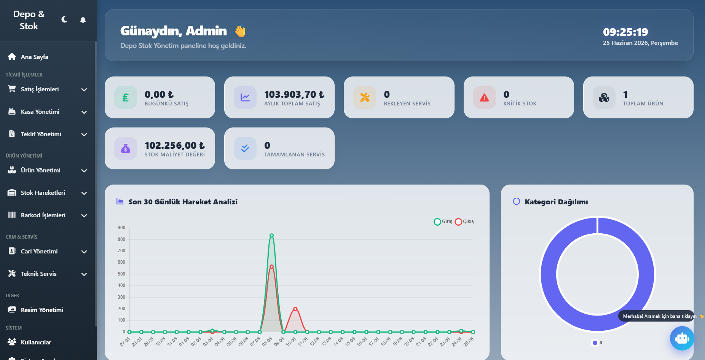
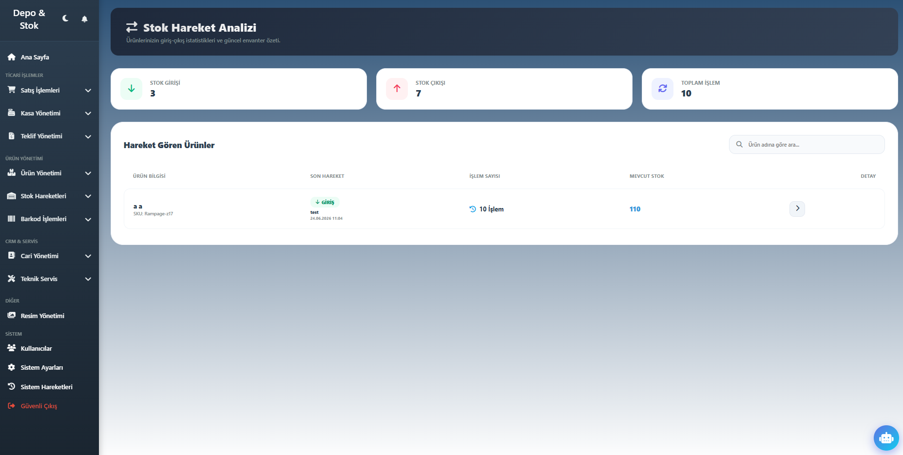
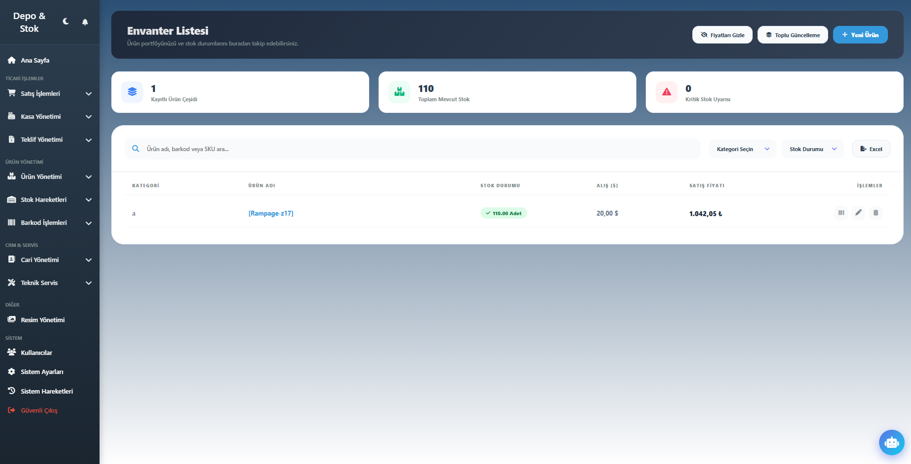
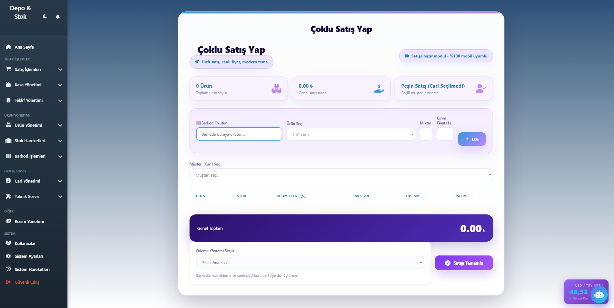
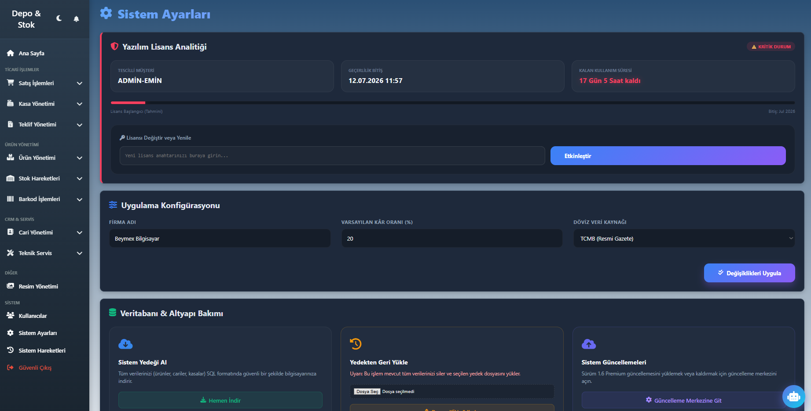

# Depo & Stok Yönetim Sistemi

Modern işletmeler için geliştirilmiş web tabanlı depo, stok, satış ve teknik servis yönetim sistemi.

## Özellikler

### Stok ve Ürün Yönetimi
- Ürün ekleme, düzenleme ve silme
- Barkod desteği
- Stok hareket takibi
- Kategori yönetimi

### Satış ve Cari Yönetimi
- Satış işlemleri
- Cari hesap yönetimi
- Kasa yönetimi
- Teklif oluşturma

### Teknik Servis
- Servis kayıtları
- Arıza takip sistemi
- Müşteri yönetimi

### Sistem Özellikleri
- Kullanıcı ve yetki yönetimi
- Otomatik yedekleme
- Lisans sistemi
- Sistem hareket kayıtları
- Karanlık tema desteği

## Kullanılan Teknolojiler

- Laravel
- MySQL
- Blade
- Bootstrap
- JavaScript
- AJAX

## Ekran Görüntüleri
### Ana Menü

### Stok Takip

### Satış İşlemi

### Kasa Sistemi

### Sistem Ayarları

## Proje Durumu

Aktif olarak geliştirilmektedir.

> Bu repo yalnızca portföy amaçlıdır. Kaynak kodlar paylaşılmamaktadır.
